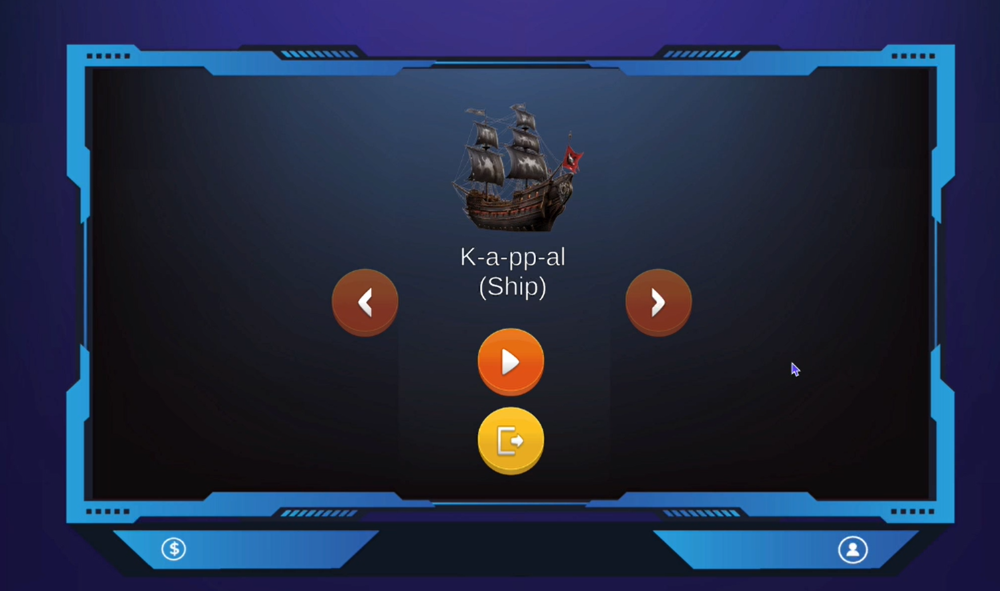
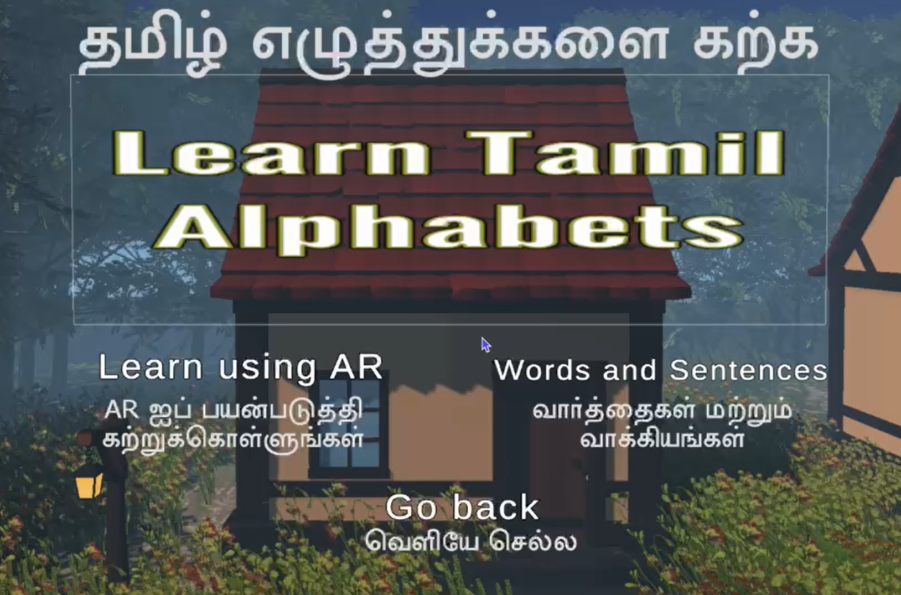
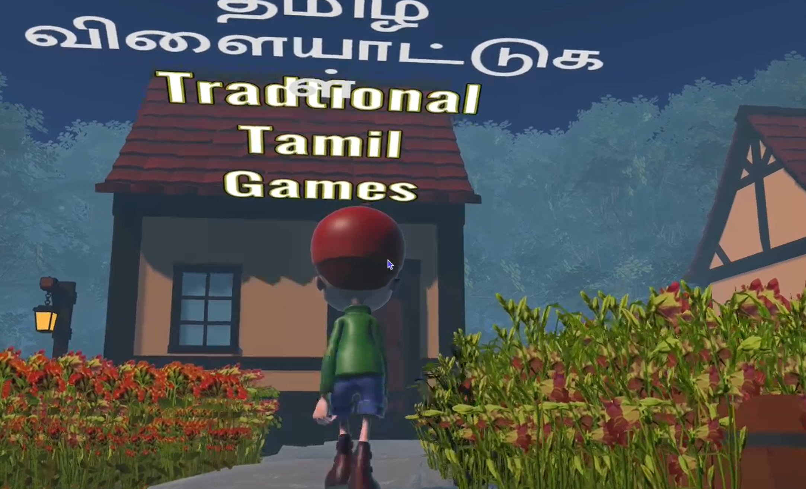
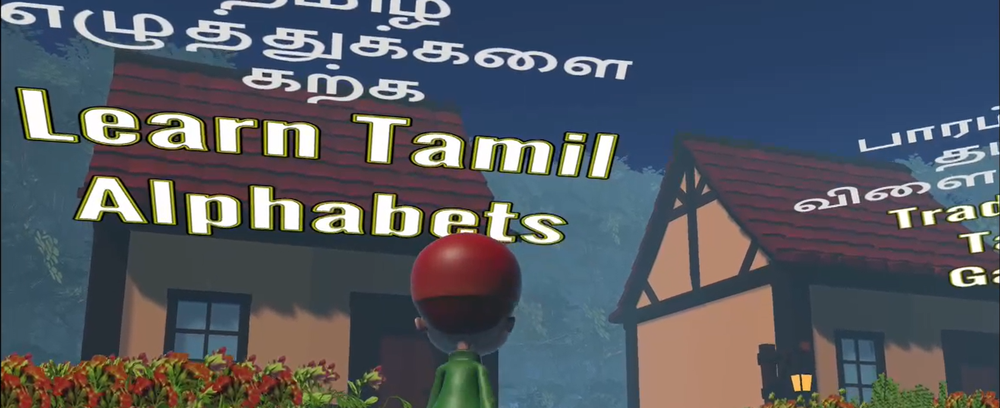
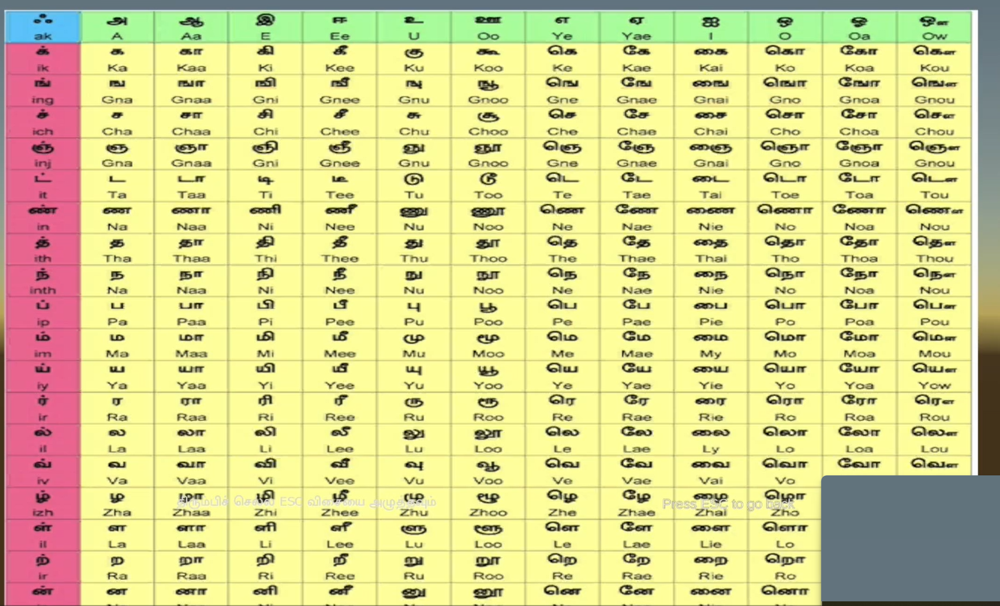

# Karkatamizh: A Gamified Tamil Learning Experience

**Karkatamizh** is a Unity 3D-based game developed for the **Kanitamiz** hackathon conducted by the Tamil Virtual Academy of the Government of Tamil Nadu, where my team proudly reached the finals. This game is designed to make learning the South Indian language **Tamil** fun and interactive through a gamified experience, set in a beautifully crafted village surrounded by mountains.

## Plot:
Players step into the shoes of a boy born in a picturesque village, which serves as the main menu. As players navigate through this village, they can explore different houses, each representing a unique menu for various activities. For example, entering the house dedicated to Tamil games allows players to engage with traditional games, complete challenges, take tests, and earn points. This structure creates a rich, immersive experience that combines learning with exploration.

## Features:
- **Learn Tamil Alphabets & Words**: Engage with Tamil letters, words, and their pronunciations in an immersive environment.
- **Pronunciation Guide**: Audio support for each letter and word helps learners develop accurate pronunciation skills.
- **Tamil Stories & Cultural Education**: Enjoy classic Tamil stories and learn about Tamil culture through interactive storytelling.
- **Traditional Tamil Games**: Experience *Jallikattu* and *Aadu Puli Aatam* (currently in development), traditional games that enrich the learning experience.
- **Blender Models**: The game utilizes 3D models created with Blender for a visually engaging experience.

## Current Development Status:
While **Karkatamizh** is no longer actively developed, I welcome external contributions to enhance the project. There are opportunities for expanding traditional game content and improving cultural representation.

## Screenshots:

## How to Contribute:
To contribute, fork the repository, implement your enhancements, and submit a pull request. Areas for potential contributions include:
- Completing the development of traditional Tamil games (*Jallikattu* and *Aadu Puli Aatam*).
- Expanding cultural content and stories.
- Adding more advanced Tamil language lessons.

Join me in the mission to make learning Tamil easier and more enjoyable through **Karkatamizh**!
